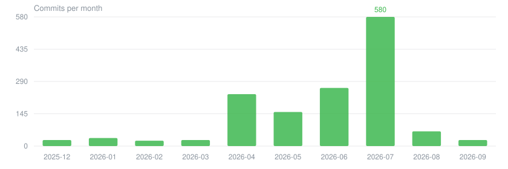

# QmClient Qm客户端

<p align="center">
   
</p>

<p align="center">
  基于 DDNet / TaterClient 构建的定制客户端项目
</p>

<p align="center">
  <a href="https://github.com/wxj881027/QmClient/actions/workflows/build.yml"></a>
  <a href="https://github.com/wxj881027/QmClient/actions/workflows/nightly.yml"></a>
  <a href="https://github.com/wxj881027/QmClient/releases/latest"></a>
  <a href="https://github.com/wxj881027/QmClient/stargazers"></a>
  <a href="LICENSE-QMCLIENT.md"></a>
</p>

> 📄 本文档另有 <a href="README.md">English</a> 版本</p>

## 📝 项目概述

QmClient客户端是基于 DDNet 和 TaterClient 构建的定制版本。  
项目旨在提供更现代的 UI 体验、更丰富的视觉效果配置选项，同时保持与核心游戏玩法的兼容性。

> 🤖 **AI agent / 贡献者**：工作流规则（commit、PR、release、构建）在 [`AGENTS.md`](AGENTS.md)，请从这里开始。

## 📥 下载

预编译包发布在 [Releases](https://github.com/wxj881027/QmClient/releases/latest) 页面。

| 平台 | 包名 |
| --- | --- |
| Windows | `QmClient-windows.zip` |
| Linux | `QmClient-ubuntu.tar.xz` |
| macOS | `QmClient-macOS.dmg` |
| Android | Release 页面上的 APK |

四个平台均由 [`build.yml`](https://github.com/wxj881027/QmClient/actions/workflows/build.yml) 构建；每夜构建来自 [`nightly.yml`](https://github.com/wxj881027/QmClient/actions/workflows/nightly.yml)。若要自行从源码构建，见[构建](#-构建)。

## ✨ 功能特性

- 流畅的 UI 过渡和 HUD 动画
- 增强的输入和交互体验
- 更丰富的客户端配置选项和自定义设置
- 保持与 DDNet 生态系统的核心兼容性

## ❤️ 贡献者

感谢所有为该项目提交代码、报告问题和提出改进建议的贡献者。

[](https://github.com/wxj881027/QmClient/graphs/contributors)

## 🚀 构建

### Windows

使用仓库包装脚本，`cmake` 始终在配置的 MSVC 开发环境中运行，即使从普通的 PowerShell 或 `cmd.exe` 会话：

```bat
qmclient_scripts/cmake-windows.cmd -S . -B cmake-build-release
qmclient_scripts/cmake-windows.cmd --build cmake-build-release --target game-client -j 14
```

### macOS / Linux / 已初始化的开发人员环境

```sh
cmake -S . -B cmake-build-release
cmake --build cmake-build-release --target game-client -j 14
```

## ✅ 测试

### Windows

```bat
qmclient_scripts/cmake-windows.cmd --build cmake-build-release --target run_cxx_tests
qmclient_scripts/cmake-windows.cmd --build cmake-build-release --target run_rust_tests
qmclient_scripts/cmake-windows.cmd --build cmake-build-release --target run_tests
```

### macOS / Linux / 已初始化的开发人员环境

```sh
cmake --build cmake-build-release --target run_cxx_tests
cmake --build cmake-build-release --target run_rust_tests
cmake --build cmake-build-release --target run_tests
```

## 📊 项目动态

两张图表由 [`readme-charts.yml`](.github/workflows/readme-charts.yml) 每日生成，并直接存放在本仓库，不依赖任何第三方图表服务。

> 提交量只统计 QmClient 的贡献者。本仓库 fork 自 DDNet，Git 历史包含两万余条上游提交（最早可追到 2007 年），不加过滤的活动图反映的会是上游的工作而非本项目。




## 🙏 特别感谢

- DDNet、Teeworlds、DDRace、TaterClient、RClient、Best Client和 CactusClient 的所有贡献者
- 参与测试、提供反馈和启发灵感的朋友们
- 继续为开源社区做出贡献的每一个人
- 所有捐赠者 – 感谢你们

## 🏛 致谢

- Teeworlds — Magnus Auvinen
- DDRace — Shereef Marzouk
- DDNet — Dennis Felsing 和贡献者
- TaterClient — 社区修改版本
- Best Client — 社区修改版本
- [BetterLyrics](https://github.com/jayfunc/BetterLyrics) — [jayfunc](https://github.com/jayfunc)
- [Lyricify Lyrics Helper](https://github.com/WXRIW/Lyricify-Lyrics-Helper) — [XY Wang (WXRIW)](https://github.com/WXRIW)
- [163MusicLyrics](https://github.com/jitwxs/163MusicLyrics)
- [NeteaseCloudMusicApi](https://github.com/Binaryify/NeteaseCloudMusicApi)
- [qq-music-api](https://github.com/Rain120/qq-music-api)
- [QQMusicApi](https://github.com/jsososo/QQMusicApi)
- [LyricCapture](https://github.com/ElliottSilence/LyricCapture)
- [ntextcat](https://github.com/ivanakcheurov/ntextcat)
- [LyricParser](https://github.com/HyPlayer/LyricParser)

## 📜 许可证

本项目基于 DDNet 和 TaterClient，采用**分层许可**：

- **继承自上游的部分** —— 来自 Teeworlds、DDRace、DDNet 与 TaterClient 的代码及 `data/` 内容（含本项目对这些文件的修改），仍分别遵循 zlib/libpng 许可证与 CC BY-SA 3.0。修改版本必须明确标注来源，不得歪曲原作者身份。
- **QmClient 自有代码** —— 保留所有权利。
- **QmClient 自制素材**（`data/qmclient` 下的聊天表情与标志图）—— [CC BY-NC-ND 4.0](https://creativecommons.org/licenses/by-nc-nd/4.0/)：署名、非商业性使用、禁止演绎。
- **第三方内容** —— 字体、图标图集（Phosphor Icons，MIT）、音乐平台互操作的移植代码与依赖库保留各自的原始许可。

每一层的准确范围见 [`LICENSE-QMCLIENT.md`](LICENSE-QMCLIENT.md)，其中同时载明音乐平台互操作代码的使用意图；上游声明与第三方归属集中在 [`license.txt`](license.txt)。

## 📮 说明

本项目为个人定制版本，不代表 DDNet 或 TaterClient 的官方立场。
