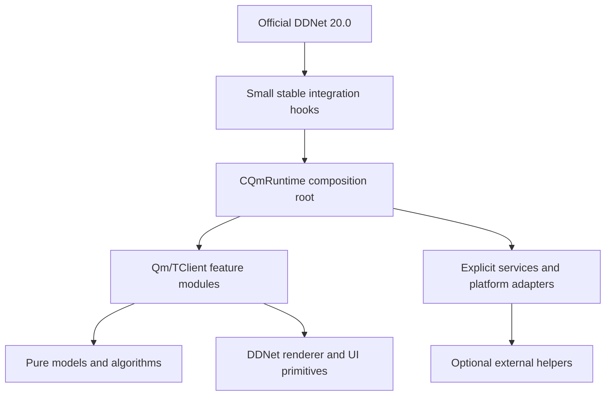

# QmClient 20.0 干净基线重构实施方案

## 1. 结论先行

本次工作应当在官方 DDNet 20.0 的干净提交上新开重构分支；当前 `dyl_dev` 只作为功能盘点、行为对照和历史实现参考，不作为重构分支的父提交。建议使用独立 worktree 开发，保留当前工作树不动，避免把当前未提交的翻译、菜单、统计、Metal 等改动带进基线。

目标不是把 DDNet 改造成一个“更现代”的新引擎，而是建立一层薄的、可删除、可测试的 QmClient 扩展层：官方代码尽量保持原样，QmClient/TClient 功能按垂直切片逐个重写，最终把对 `CGameClient`、`menus.cpp`、`hud.cpp`、`chat.cpp` 等官方文件的修改收敛到少数稳定适配点。

原报告的主方向正确，但以下内容需要调整：

- 保留官方 `CComponent` 体系，不重新发明一套平行生命周期系统。
- 不一开始创建承载所有功能的万能 `FeatureManager`、全局 `Service Layer` 或 `EventBus`；这些抽象只有在具体迁移任务出现重复依赖时才增加。
- 采用一个很薄的 QmClient composition root，并允许部分功能在过渡期继续作为原生 `CComponent`，避免为了“统一”一次性搬动高风险代码。
- 不自建通用文字渲染系统来替代 DDNet 20.0 的缓存；先复用上游能力，以实测数据证明仍有缺口后再增加 QmClient 专用缓存。
- TClient 不是运行时依赖，也不是新的 Core；它是需要重新分类、重新实现和逐项验收的功能来源。

## 2. 工作边界

### 2.1 本次要完成的事情

1. 从官方 DDNet 20.0 建立可构建、可启动、可联网、可游玩的干净基线。
2. 建立 QmClient 扩展层的最小入口、边界和构建清单。
3. 对当前 QmClient 与 TClient 的功能做完整盘点，标记为 `UPSTREAM`、`KEEP`、`PORT`、`REWRITE`、`DELETE` 或 `DEFER`。
4. 逐个迁移栖梦和 TClient 功能，每个功能都具有独立的代码、测试、性能和运行时验收证据。
5. 将 QmClient 自有代码模块化，新增单个 `.cpp` / `.h` 原则上不超过 2000 行；超过时必须拆为模型、逻辑、渲染、平台适配或数据访问模块。
6. 建立后续同步官方 DDNet 的台账、冲突边界和定期 rebase 流程。

### 2.2 明确不做的事情

- 不在这次工作中修改协议字段、snapshot 布局、demo/skin/map 格式、物理、预测语义或服务端玩法。
- 不为了架构整洁复制 DDNet 的 `CGameClient`、渲染器、网络层、UI 基础设施或配置宏系统。
- 不把 QmClient 做成动态 DLL 插件；当前 ABI、生命周期和内部渲染接口不足以支持稳定插件契约。
- 不直接把当前分支的所有提交 cherry-pick 到新基线。当前实现只作为行为来源，逐功能确认后重新实现。
- 不一次性删除当前 QmClient/TClient 目录；旧代码作为迁移对照，直到对应新功能完成验收再删除。
- 不把“官方文件修改少于 10 个”作为硬性数字；它是趋势指标，不得为了达标制造更复杂的隐式耦合。

## 3. 当前仓库的真实起点

以下信息用于确认迁移规模，不表示当前仓库已经完成重构。

### 3.1 历史来源快照，不是重构分支现状

下面的旧仓库信息只用于建立功能来源索引，不代表当前重构分支已经包含这些代码：

- 旧实现来源提交为 `b05fa3330`，来源分支为 `dyl_dev`。
- 旧来源的版本声明仍是 DDNet 19.x，并混有 QmClient/TClient 私有改动。
- 官方 DDNet 20.0 基线提交为 `a5a61806e434`；重构分支必须直接从该提交派生。
- 旧工作树中的未提交修改、旧文档和旧目录不能作为新分支的构建或架构事实。

当前重构分支的版本、组件列表、CMake 和线程事实以 `docs/qmclient/20.0-baseline-audit.md` 为准。

### 3.2 旧来源功能规模

旧来源代码不是简单的几个视觉组件。以下数字是迁移规模的历史快照，不是新分支现状：

- `src/game/client/components/qmclient/` 约 108 个 `.cpp` / `.h` 文件、约 31.5k 行。
- `src/game/client/components/tclient/` 约 43 个 `.cpp` / `.h` 文件、约 21.3k 行。
- 当前超过 2000 行的第三方新增文件至少包括 `qmclient.cpp`、`menus_qmclient.cpp`、`voice_core.cpp`、`tclient.cpp`、`menus_tclient.cpp`、`fast_practice.cpp`。
- QmClient 配置头约 537 行，TClient 配置头约 233 行，说明配置兼容性本身也是迁移契约，不能在第一阶段随意改名。
- 当前测试树已有约 30 个 QmClient/TClient 相关测试文件；这些测试应作为行为参考，但不能替代新基线上的端到端验证。

### 3.3 旧来源架构事实

旧来源的 `CGameClient` 直接 include QmClient/TClient 头文件，并直接持有 `CQmClient`、`CTClient` 及大量相关组件成员。

启动时，旧来源的 `CGameClient::OnConsoleInit` 使用 `AddComponent` 将所有组件逐一放入同一个列表，QmClient 和 TClient 组件也在其中。之后所有组件统一经过生命周期、更新、渲染和消息分发流程；输入则使用另一套有明确优先级的列表。

这意味着当前问题不是“没有 Component”，而是：

```text
CGameClient
  ├── 直接拥有大量 Qm/TClient 成员
  ├── 直接注册所有扩展组件
  ├── 官方组件直接访问 m_QmClient / m_TClient
  └── menus.cpp / hud.cpp / chat.cpp 等承担跨层桥接
```

例如 `chat.cpp` 直接读取 TClient 的正则过滤器并调用 Qm HUD 通知逻辑（`src/game/client/components/chat.cpp:1240-1285`），菜单直接读取 QmClient 统计状态（`src/game/client/components/menus.cpp:2894-3163`），这类跨层调用应作为迁移期间的依赖清单，而不是被新架构继续复制。

### 3.4 旧来源大文件和构建事实

旧来源的 `qmclient` 与 `tclient` 源码被直接列入根 `CMakeLists.txt` 的 game-client 源文件列表，配置头也在通用 engine shared 源列表中；歌词和网易云 hook 还拥有独立的 helper / DLL 目标。

因此，新架构的 CMake 目标应是“减少根文件中散落的第三方源文件”，而不是未经验证地套用 `add_subdirectory`。官方 20.0 的目标变量和源文件组织应先确认，再只增加一个稳定的 QmClient source manifest include 点。

## 4. 目标架构

### 4.1 总体形状



建议最终目录如下，实际路径以新分支中的代码量和 DDNet 20.0 习惯为准：

```text
src/game/client/components/qmclient/
├── core/
│   ├── qm_runtime.{h,cpp}          # 唯一的组合根，保持很薄
│   ├── qm_context.{h,cpp}          # 按能力提供非拥有型窄接口
│   ├── qm_feature.h                 # 最小 feature 合约
│   └── qm_source_manifest.cmake     # 或由根 CMake include 的清单
├── features/
│   ├── visual/
│   ├── hud/
│   ├── input/
│   ├── gameplay_presentation/
│   └── menu/
├── services/
│   ├── statistics/
│   ├── map_history/
│   ├── chat/
│   └── media/
├── ui/
│   ├── common/
│   ├── hud/
│   ├── settings/
│   └── monitor/
├── platform/
│   ├── windows/
│   └── shared/
└── algorithms/
```

`QmUi` 可先保留为独立的、偏纯逻辑的 UI 工具目录；它不需要为了目录好看而全部搬入 `qmclient/ui`。新代码应优先按所有权和依赖方向移动，而不是按名称批量移动。

### 4.2 `CQmRuntime` 的职责

`CQmRuntime` 是一个薄的 `CComponent`，在官方组件系统中只有一个稳定的 QmClient 注册点。它只负责：

- 初始化和关闭 QmClient 扩展；
- 保存 feature/service 的所有权；
- 按明确顺序分发 `OnInit`、`OnShutdown`、`OnReset`、`OnUpdate`、`OnRender`、`OnMessage`、`OnStateChange` 等必要生命周期；
- 管理输入 feature 的固定优先级；
- 记录扩展层的 debug / performance 统计；
- 向 feature 提供窄化后的 context。

它不负责：

- 解析网络消息的业务内容；
- 计算所有 HUD 数据；
- 代替 `CGameClient` 保存 snapshot、预测世界或物理状态；
- 让所有模块相互查找；
- 变成 3000 行以上的“上帝对象”。

首版允许同时存在两种形态：

1. 已迁移的低风险 feature 由 `CQmRuntime` 拥有并分发。
2. 尚未迁移或必须参与 DDNet 原生输入/渲染排序的功能暂时保持独立 `CComponent`，但登记在迁移台账中。

只有当某功能已经有稳定的 feature 合约和测试后，才从 `CGameClient` 直接成员迁入 runtime。这样能避免为了统一生命周期而改变输入优先级、渲染顺序或网络时序。

### 4.3 Feature 合约

不要为每个功能强制实现所有回调。推荐使用小接口或能力组合：

```cpp
class IQmFeature
{
public:
    virtual ~IQmFeature() = default;
    virtual void OnInit() {}
    virtual void OnShutdown() {}
    virtual void OnReset() {}
    virtual void OnUpdate() {}
    virtual void OnRender() {}
    virtual void OnMessage(int MsgType, void *pRawMsg) {}
    virtual void OnStateChange(int NewState, int OldState) {}
};

class IQmInputFeature
{
public:
    virtual ~IQmInputFeature() = default;
    virtual bool OnInput(const IInput::CEvent &Event) = 0;
};
```

实际实现时应按仓库风格决定是否使用纯虚基类、默认实现或静态组合。关键约束是：

- feature 不拥有 `CGameClient`、graphics、storage 等全局接口；
- feature 只持有非拥有型窄引用；
- 输入优先级写在 runtime 的固定注册表中，不靠 unordered map 或未定义的注册顺序；
- feature 之间不直接互相调用，跨功能数据通过明确的 model/service/adapter 传递；
- 高速 snapshot、预测和渲染路径避免 `std::function`、动态分配和字符串格式化。

### 4.4 Context 和服务

不建立一个暴露几十个接口的万能 `CQmClientContext`。建议按使用场景拆成小型 façade：

```text
CQmRenderContext       -> IGraphics / ITextRender / RenderTools
CQmGameStateView       -> 只读玩家、snapshot、地图视图
CQmInputContext        -> 输入状态和发送入口
CQmStorageContext      -> IStorage 的受限操作
CQmNetworkContext      -> 明确允许的请求和主线程回收
```

服务只在有独立生命周期、共享状态或异步所有权时引入。例如统计、地图历史、媒体 provider 可以是 service；一次仅被一个 feature 使用的两三个函数不需要 service。

异步服务必须遵循：

```text
主线程创建请求
    -> worker / HTTP / helper
    -> 结果快照或消息
    -> 主线程接收并替换状态
    -> UI / Render 只读稳定状态
```

worker 不直接修改 UI、`CGameClient` 或 graphics 对象；退出和 map unload 时由拥有者取消或等待任务，避免悬空引用。

### 4.5 EventBus 的使用边界

首版不实现通用 EventBus。优先使用以下顺序：

1. 直接调用同一 feature 内的函数。
2. 由 service 更新一个只读 model，多个消费者读取 model。
3. 确实存在“一次发生、多个互不相关订阅者消费”的语义时，再引入类型明确的事件。

禁止把每个 getter、配置变化和每帧更新都事件化。事件对象要有来源、生命周期、线程归属和重复投递策略，否则只会把当前的直接耦合变成不可追踪的隐式耦合。

## 5. 上游易合并性设计

### 5.1 官方文件修改分类

将新分支中的改动分为三类：

| 类别 | 允许的文件 | 规则 |
|---|---|---|
| QmClient 独立文件 | `src/game/client/components/qmclient/`、`src/game/client/QmUi/`、Qm 配置/测试 | 新功能优先落这里 |
| 稳定适配文件 | `gameclient.cpp/h`、少数 `menus_*` / `hud_*` / `chat_*` | 只保留生命周期注册、窄桥接和确有必要的 upstream hook |
| 官方核心文件 | engine、protocol、prediction、renderer 核心 | 默认禁止；需要单独说明和审批 |

目标不是完全零个官方文件，而是让官方文件中的 QmClient 逻辑具备以下形状：

```cpp
GameClient()->QmRuntime().RenderHud(...);
```

而不是把 provider、配置解析、字符串格式化和业务规则继续放进 `hud.cpp` 或 `menus.cpp`。

### 5.2 CMake 策略

- 新分支先完全通过官方 20.0 的构建，不急于改造 CMake。
- 20.0 基线实际使用根 `CMakeLists.txt` 的 `set_src(GAME_CLIENT GLOB_RECURSE src/game/client ...)`，同时对清单进行排序和一致性检查。QmClient 新文件先遵守这一上游机制。
- 只有当清单拆分能减少冲突且不绕过上游校验时，才引入一个 QmClient manifest include 点；不使用无约束的额外 `GLOB_RECURSE` 隐藏新文件。
- 独立 helper / hook 目标继续与主 client 分开，歌词解析等纯算法可复用，但平台注入、Windows API、helper 进程和主 client 之间不能形成循环依赖。
- 资源清单、icon atlas、内置脚本和语言产物同样集中登记，避免再次散落在根 CMake 多个位置。
- 每个功能的 CMake 增量必须在迁移台账中记录目标、平台条件和测试目标。

### 5.3 Git 和同步策略

提交粒度按“一个可回滚能力”划分：

```text
refactor(qm): establish 20.0 baseline notes
refactor(qm): add thin runtime hook
refactor(qm): add feature contract and context
feat(qm): port trails
feat(qm): port player indicator
perf(qm): cache monitor model
test(qm): add feature contract regressions
```

一个提交不同时包含全仓库格式化、无关上游同步和一个新功能。每个阶段结束时记录：

- 官方基线 hash；
- QmClient 修改文件数；
- 官方文件修改列表；
- 未解决冲突；
- 构建、测试、运行时和性能证据；
- 下一次 rebase 的风险点。

## 6. 分支和 worktree 方案

### 6.1 推荐结构

```text
ddnet-upstream/master       # 官方远端跟踪分支
baseline/ddnet-20.0         # 不开发，只固定官方 20.0 提交
codex/qmclient-20.0-rebuild # 新重构主线
feature/qm-<name>           # 从重构主线切出的单功能分支
dyl_dev                     # 当前旧实现维护线，不作为新基线
```

分支命名可按团队约定调整；仓库当前 agent 约定默认使用 `codex/` 前缀。重要的是父提交关系，而不是名字：重构分支必须直接从官方 20.0 提交创建。

### 6.2 创建顺序

以下命令是实施时的参考，不在本次文档任务中执行：

```powershell
git fetch ddnet-upstream --tags
git show --no-patch --decorate a5a61806e434
git branch baseline/ddnet-20.0 a5a61806e434
git worktree add ..\QmClient-20-rebuild -b codex/qmclient-20.0-rebuild baseline/ddnet-20.0
```

如果本地尚未存在 `a5a61806e434`，先确认该对象确实来自官方 DDNet 20.0 tag，再创建分支；不要用当前 `master`、`dyl_dev` 或未确认的 `ddnet-upstream/master` 替代它。当前仓库的 `ddnet-upstream/master` 已可能指向 20.1 或更后的开发状态，不能把远端分支名当作 20.0 基线。

### 6.3 为什么 worktree 比只开 branch 更合适

单纯开分支在同一个工作目录也能工作，但当前工作树已经有并行未提交改动。独立 worktree 可以同时满足：

- 保留当前 `dyl_dev` 的未提交工作；
- 让新基线的 `git status` 从第一天就是可审计的；
- 便于在旧实现和新实现之间对照行为；
- 不需要 stash、强制清理或临时回退用户改动。

因此答案是：**应该新开分支，而且最好从官方 20.0 提交创建独立 worktree；不应该从当前脏的 `dyl_dev` 分支派生。**

## 7. 分阶段实施计划

### Phase 0：建立基线和冻结规则

产物：`baseline/ddnet-20.0`、重构 worktree、基线构建记录。

步骤：

1. 拉取并校验官方 20.0 tag 与 commit。
2. 在新 worktree 中确认 `git status` 干净。
3. 用官方构建入口生成 Debug / Release 至少一个桌面构建。
4. 运行官方 C++ / Rust 测试。
5. 完成启动、主菜单、server browser、连接、进入游戏、移动、断开、demo 播放、编辑器 smoke。
6. 记录启动耗时、空闲帧耗时、游戏帧耗时、内存基线和构建环境。

验收：官方 20.0 行为可用；任何基线问题先归到上游基线，不在 QmClient 迁移提交中偷偷修复。

### Phase 1：功能盘点和行为契约

产物：`docs/superpowers/plans/2026-09-02-QmClient-20功能迁移台账.tsv`，每行一个可独立验收的功能。

建议字段：

```text
id, source_paths, feature_name, owner, category, upstream_status,
config_keys, resources, direct_upstream_files, risk,
target_module, tests, smoke_steps, performance_budget,
status, replacement_commit, evidence, notes
```

盘点时不要以目录名直接决定归属。至少按以下维度重新分类：

| 功能组 | 当前来源 | 初始风险判断 | 首选动作 |
|---|---|---:|---|
| 纯算法/格式 | `input_overlay_format`、歌词 KRC/QRC、部分 map/stat model | 低 | 先迁移并补纯函数测试 |
| 视觉效果 | trails、jelly、player indicator、outlines、particles、moving tiles | 中 | 保持 DDNet 渲染顺序，逐个迁移 |
| HUD/UI | statusbar、HUD notifications、monitoring、input overlay、QmUi | 中 | model 与 render 分离，逐页验收 |
| 菜单/设置 | `menus_tclient.cpp`、`menus_qmclient.cpp`、`menus.cpp` 桥接 | 中高 | 按页面/卡片拆，不搬巨型文件 |
| 聊天/绑定 | bindchat、bindwheel、emoji、chat hooks | 中 | 保持输入优先级和聊天时序 |
| 统计/地图历史 | QmClient statistics、map history、Axiom | 中 | service/model 化，主线程交换结果 |
| 外部生态 | lyrics、网易云、汽水、voice、scripting | 高 | 平台 adapter 与主 client 隔离 |
| 预测/反延迟 | fast practice、antiping、ghost、collision/hit detection | 很高 | 最后迁移，行为合同优先 |

判定规则：

- `UPSTREAM`：20.0 已有等价实现，删除第三方实现并验证配置/行为兼容。
- `KEEP`：保留当前实现，但只做最小整理，已有边界清楚。
- `PORT`：行为稳定，按新目录和合约迁移，不改变用户语义。
- `REWRITE`：当前实现过大、耦合或平台边界不清，重新设计纯模型和接口。
- `DELETE`：确认无人使用、与上游重复或维护成本大于价值。
- `DEFER`：需要协议、平台、服务端或外部运行环境，暂不阻塞主线。

### Phase 2：最小 Runtime 和集成点

只实现以下内容：

- 一个 `CQmRuntime` 组件入口；
- 最小 feature 合约；
- 最小 context，先支持生命周期、日志、配置只读访问；
- 固定的 feature 注册顺序和输入优先级；
- QmClient 源文件 manifest；
- 最小启动/关闭/重置回归测试或源码合同测试。

这一阶段不迁移大功能，不引入 EventBus，不引入通用 text cache，不实现网络业务 service。验收重点是：启用空 runtime 不改变官方 20.0 的启动、帧时间和退出行为。

### Phase 3：低风险功能

先迁移不触碰物理、预测和协议的模块：

1. 纯数据模型、格式化和解析器；
2. Qm/TClient 的通用小工具；
3. input overlay 数据格式与静态布局；
4. map history / statistics 的纯 model；
5. chat emoji、颜色规则、部分通知规则。

每次迁移都采用：

```text
旧行为样本或失败测试
    -> 新模块最小实现
    -> 单元测试
    -> 新旧结果对照
    -> 从旧入口切换
    -> 删除旧路径
```

### Phase 4：视觉和 HUD 功能

推荐顺序：trails、jelly、player indicator、outlines、background particles、moving tiles、weapon presentation、HUD notifications、statusbar、monitoring、input overlay。

约束：

- 不改变官方实体绘制和 camera 顺序；
- hidden feature 的更新成本接近零；
- render 只读取已准备好的 model；
- 文本容器、quad container 和纹理在状态变化或尺寸变化时更新，而不是每帧重建；
- 必须在至少一个 OpenGL/Vulkan 或目标平台后端完成实际截图/运行时检查，不能只看单元测试。

### Phase 5：菜单和 QmUi

不要把 `menus_qmclient.cpp`、`menus_tclient.cpp` 原样搬到新分支。按用户页面和数据模型拆分：

```text
ui/settings/
  visual_page
  gameplay_page
  hud_page
  integrations_page
ui/monitor/
  monitor_model
  monitor_layout
  monitor_render
ui/common/
  cards
  rows
  dropdowns
  navigation
```

菜单桥接只负责把 model 接到官方菜单生命周期；业务统计、HTTP 状态、排序和文本缓存不得再次堆进 `menus.cpp`。设置键名暂时保持兼容，通过迁移函数处理重命名，不用一次性重做配置文件格式。

### Phase 6：聊天、绑定、统计和外部服务

这一阶段处理：

- bindchat、bindwheel、chat integration；
- QmClient server time、playtime、statistics、Axiom；
- map history、custom communities、server list 扩展；
- lyrics / Netease / Soda / voice / scripting。

外部服务采用 provider / adapter 边界：

```text
Game client feature -> Media state model -> Provider adapter -> helper/API
```

主 client 不直接知道 QQ Music、网易云、HTTP endpoint 或 helper 进程细节。平台不可用时必须能编译并启动主 client，功能以明确的 disabled 状态退出。

### Phase 7：高风险 TClient 功能

最后迁移 fast practice、antiping、预测 ghost、collision/hit detection 等功能。每个功能必须先写行为不变量：

- 默认配置下官方 20.0 行为不改变；
- 开关关闭时不改变预测、输入和 snapshot 时序；
- dummy / demo / replay / spectator 分支与旧实现一致；
- tick 边界、map unload、disconnect、重连时状态清零；
- 不向服务器发送新的协议语义；
- 性能开销只出现在功能开启且相关场景存在时。

这一阶段禁止以“顺便重构预测”为理由改动上游预测核心。若确实发现旧功能依赖官方核心修改，另建独立 RFC 和风险审查，不混入普通 feature 迁移。

### Phase 8：删除旧层和第一次 rebase 演练

当一个功能的新实现完成以下条件后，才删除旧代码：

- 新入口已接管所有调用点；
- 旧类名、旧成员和旧配置迁移路径无残余引用；
- 单元测试、构建和 smoke 通过；
- 性能不劣于旧实现或差异有记录；
- 至少经历一次官方上游更新或模拟 rebase。

最后再删除空的 TClient/QmClient 聚合器、冗余菜单文件和已被上游吸收的功能。不要先删目录再依靠记忆重写。

## 8. 性能方案

### 8.1 基线和指标

在 Phase 0 记录官方 20.0 基线，在每个高频功能迁移后对比：

- idle menu / idle gameplay 的 CPU frame time；
- update 与 render 分项耗时；
- GPU frame time、draw calls、quad/text container 数量；
- 每帧分配次数或可观测的临时容器增长；
- UI 可见/隐藏两种状态；
- server browser / monitor / scoreboard 的长列表场景；
- Windows、Linux、macOS 和移动平台中实际支持的后端差异。

### 8.2 代码规则

- update 阶段计算状态，render 阶段只消费稳定快照；
- 字符串格式化、排序、JSON 解析和 provider 请求不得出现在每帧 render；
- feature disabled 时不创建任务、不扫描玩家、不构造文本容器；
- UI cache 的 key 必须包含真实影响布局/绘制的字段；
- job 结果使用版本号、generation 或 map/session id 防止旧任务覆盖新状态；
- 不以“加 cache”掩盖生命周期错误；每个 cache 都有失效条件和释放点。

### 8.3 目标

先使用相对目标，不在没有硬件和场景数据时承诺绝对 FPS：

| 场景 | 目标 |
|---|---|
| 所有 Qm 功能关闭 | 接近官方 20.0 基线 |
| 隐藏 HUD / monitor | 不做业务计算，额外耗时接近零 |
| 普通视觉 feature 开启 | 不产生可见帧节奏回归 |
| monitor / server browser 可见 | 数据更新与绘制可分离，长列表不持续重建文本 |
| 外部 provider 不可用 | 不阻塞主线程，不影响主 client 启动和游戏 |

## 9. 配置、资源和兼容性

### 9.1 配置

继续使用 DDNet 的 config macro 基础设施。`qm_` / `Qm` 是新增配置的命名边界；现有 `tc_` 配置是用户配置兼容契约，不为了目录重排就立即改名。

配置迁移分三步：

1. 新基线中只加入经过盘点的必要键。
2. 对确实要改名的键保留旧键读取和一次性迁移。
3. 所有旧键完成迁移后，再标记 deprecated；删除必须有 release note 和配置回滚策略。

配置头按注释分组即可，不要把宏系统强行包装成运行时 `Gameplay` / `Graphics` C++ 对象。脚本提取、i18n source 和 `data/languages` 产物仍遵循当前工作流。

### 9.2 资源

每个 feature 的资源放在对应清单中，注明：

- 打包路径；
- 是否可选；
- 是否需要生成步骤；
- 缺失时的 fallback；
- 哪些平台可用；
- 是否由 helper 或主 client 使用。

### 9.3 外部依赖

分类为：

- 主 client 必需；
- feature 可选；
- helper / hook 专用；
- 仅开发和测试使用。

主 client 不应链接仅用于歌词或注入的 Windows helper 依赖。平台代码通过编译条件和小 adapter 隔离，避免把 Windows API 传入通用 Qm feature。

## 10. 测试和验收门禁

### 10.1 每个 feature 的最小交付包

- 纯逻辑测试或源码合同测试；
- 至少一个配置关闭/开启用例；
- 生命周期用例：init、reset、disconnect、map unload；
- 需要时加入 dummy、demo、spectator 和多平台分支；
- 真实 client smoke 步骤；
- 性能对比记录；
- 文件行数和依赖方向检查。

### 10.2 分层验证

按仓库 `qmclient-verification-gate` 约定，代码阶段使用 quick/default/full 对应的门禁；同一 build 目录中的 `game-client`、`run_cxx_tests`、`run_rust_tests`、`package_default` 串行执行。文档阶段只做路径、链接、状态和事实人工核对，不把未执行的构建写成通过。

推荐顺序：

```text
纯逻辑测试
  -> 目标 C++ 测试
  -> game-client 构建
  -> 全量 C++ 测试
  -> Rust 测试
  -> quick/default gate
  -> 真实 client smoke
  -> 性能对比
```

### 10.3 Upstream rebase 门禁

每个阶段结束时执行一次模拟检查：

```text
官方基线更新
  -> rebase / merge
  -> 查看冲突文件
  -> game-client build
  -> 全量测试
  -> smoke
  -> 更新 upstream-patches / migration ledger
```

记录 QmClient 修改的官方文件数量和冲突数量，但只把它们当趋势，不把数字本身当质量证明。

## 11. 项目质量红线

### 必须坚持

- 一个功能一个边界，一个 owner，一个验收条目。
- 新增文件尽量小于 2000 行；大文件先拆再继续添加功能。
- 官方文件只做窄 hook，且每个 hook 有原因和删除条件。
- 高风险预测/协议/时序改动单独审查。
- 禁止循环依赖和 feature 互相直接调用。
- 禁止 render 中做网络、磁盘、解析、排序或大规模格式化。
- 禁止没有取消/代际校验的后台任务。
- 禁止全仓库无关格式化。
- 禁止在新分支混入当前脏工作树的用户改动。

### 允许但要有证据

- 少量稳定 adapter；
- 按真实复用引入的 service；
- 事件模型；
- QmClient 专用 cache；
- 对官方文件的最小桥接；
- 平台专用 helper。

## 12. 推荐的第一批实际任务

新分支创建后，不要直接从 trails 或菜单大重写开始。第一批应当是：

1. 固定官方 20.0 baseline 和完整验收证据。
2. 建立功能迁移台账，先覆盖当前 `qmclient/`、`tclient/`、`QmUi/`、配置、资源和测试。
3. 生成官方文件依赖清单：哪些 Qm/TClient 调用点位于 `gameclient.cpp`、`hud.cpp`、`chat.cpp`、`menus.cpp`、`menus_*`、`CMakeLists.txt`。
4. 写最小 `CQmRuntime` 和空 runtime smoke，不迁移业务。
5. 迁移一个纯逻辑模块，最好是已有测试覆盖的格式/规则代码。
6. 迁移一个低风险视觉模块，验证 render 顺序和关闭时开销。
7. 以这两个模块演练一次提交、回滚、rebase 和台账更新。
8. 评审目录和 feature 合约是否足够，再批量迁移后续功能。

## 13. 完成标准

本次重构不以“所有旧代码已搬完”作为唯一完成标准，而以以下状态作为主线完成：

- 新分支的父提交可明确追溯到官方 DDNet 20.0；
- 官方默认行为和功能在基线验证中可用；
- QmClient/TClient 功能都有迁移结论，没有“暂时放着”的无主代码；
- QmClient 绝大多数业务实现位于独立目录，官方文件只保留稳定 hook；
- 关闭功能的额外开销接近零；
- 高风险功能具有行为不变量和运行时证据；
- 新增单文件规模受控，菜单、runtime、service 不再继续膨胀；
- CMake、配置、资源、i18n、测试和 helper 依赖均可单独追溯；
- 至少完成一次从更新后的官方分支到 QmClient 重构分支的 rebase 演练；
- 后续新增功能能够在不修改多个官方文件的情况下实现。

## 14. 与原报告的最终取舍

原报告中“官方 20.0 + 薄扩展层 + 增量迁移 + 不做动态插件 + 量化性能 + 维护 upstream 台账”的核心判断应保留。

本方案把它具体化为：官方 20.0 是真正的父提交，当前仓库只是来源；`CQmRuntime` 是组合根而不是万能管理器；TClient 必须按功能重写而不是整体作为 Core；服务和事件只在需求出现时引入；官方 20.0 已有的 UI/text/cache 基础设施优先复用；高风险预测和时序功能最后迁移；每个阶段用独立提交、测试、smoke 和 rebase 证据闭环。

这个顺序能让重构在中途也始终可运行、可回滚、可同步，而不是等所有功能重写完才第一次知道架构方向是否正确。

## 15. 本会话补充的设计决策

本节是对本方案的增补。它专门处理翻译、上下游边界、双 UI、动画、性能和文档精简问题。所有实现细节都必须先以官方 DDNet 20.0 的实际代码为准；当前 QmClient 代码只用于建立迁移索引，不能反向决定新架构。

### 15.1 第一性原理：先审计 20.0，再设计扩展

新分支建立后，先对官方 20.0 做一次有限范围的架构审计，至少确认：

- `CClient`、`CGameClient`、`CComponent` 的生命周期和线程边界；
- 官方 component 注册、输入优先级、更新顺序、渲染顺序和消息分发方式；
- 官方 UI、文本容器、字体、图标和资源加载机制；
- 官方配置宏、语言文件生成和运行时 fallback；
- 官方 CMake game-client target、平台条件和资源打包方式；
- 官方已有的 frame timing、GPU timing、缓存和 debug 日志能力。

审计结果要记录为新分支的 `docs/qmclient/20.0-baseline-audit.md`，只保留当前基线仍然成立的事实。当前仓库的旧方案、旧目录和旧日志不作为该审计的输入结论；它们只能在 Phase 1 迁移盘点时提供“曾经做过什么”的线索。

```text
官方 20.0 基线事实
    -> QmClient 可使用的稳定接口
    -> 哪些能力需要 upstream hook
    -> 哪些功能可以完全在 QmClient 独立实现
```

### 15.2 三类所有权：底层、适配、原生功能

以后每一项需求都必须先标记所有权，不以“代码现在放在哪里”判断它属于哪一层。

| 类型 | 含义 | 典型例子 | 实施规则 |
|---|---|---|---|
| `UPSTREAM_BASE` | 官方 DDNet 能力或官方语义 | 网络、预测、renderer、基础 UI、协议 | 新分支优先直接使用，不复制 |
| `Qm_NATIVE` | QmClient 使用公开能力即可完成 | 独立 HUD、卡片、歌词展示、颜色效果、统计展示 | 只改 QmClient 目录和稳定注册点 |
| `Qm_ADAPTER` | 功能本身属于 Qm，但需要底层暴露小能力 | 粒子效果开关、绘制阶段回调、统一 frame telemetry | 以最小 adapter/hook 形式修改官方文件 |
| `UPSTREAM_CHANGE` | 会改变官方底层语义或共享行为 | 预测规则、snapshot、协议、地图、渲染器核心 | 默认禁止，单独设计、审查、测试和同步 |

“开关粒子效果”是 `Qm_ADAPTER` 还是 `UPSTREAM_CHANGE`，取决于实现：如果只是官方已有粒子组件提供可控的启用接口，属于 adapter；如果要改变粒子系统的生命周期、渲染语义或所有客户端的默认行为，就属于底层改动，必须单独处理。

每个 `Qm_ADAPTER` 都要有一张记录卡：

```text
hook_id
official_file
hook_reason
public_contract
default_behavior
disabled_behavior
upstream_conflict_risk
removal_condition
tests
```

适配层不得包含歌词 provider、卡片布局、统计业务或平台 API。这样以后上游冲突只集中在可识别的 hook，而不是在官方业务文件里重新寻找 QmClient 逻辑。

### 15.3 底层改动的隔离方式

底层改动必须同时满足以下条件：

1. 默认关闭或保持官方原行为。
2. 有明确的 C++ 接口或配置边界，不通过全局变量偷渡状态。
3. 不引入 QmClient UI、网络服务或第三方 provider 依赖。
4. 有官方行为回归测试和 Qm 开关测试。
5. 有独立提交，提交说明标注 `UPSTREAM_CHANGE` 或 `Qm_ADAPTER`。
6. 在 `docs/qmclient/upstream-patches.md` 中写清楚上游提交后如何重新判断。

推荐的依赖方向是：

```text
DDNet base API
    <- small Qm adapter hook
        <- Qm feature
            <- Qm UI / Qm service
```

不能反过来让 DDNet 基础层 include Qm UI、Qm service 或外部平台实现。对于无法隔离的底层能力，宁可暂缓功能，也不要用跨层 include 先把功能“做出来”。

## 16. 翻译和 i18n 精简方案

### 16.1 目标

翻译系统的目标不是重新发明一套完整本地化框架，而是：

- 官方 DDNet 翻译和 QmClient 翻译各自拥有边界；
- QmClient 只有一个可审计的源格式；
- 生成文件是产物，不手工编辑；
- 提取、校验、生成命令少而稳定；
- 新增功能不会把 CJK 文案、重复 key 或机器翻译草稿带入运行时。

### 16.2 建议的源和产物

新分支先读取官方 20.0 的真实语言管线，再在不改官方管线的前提下增加 Qm overlay：

```text
translations/i18n/qmclient/*.toml     # QmClient 唯一维护源
          |
          +-- extract_qm_strings       # 从代码和配置提取候选
          +-- validate_qm_catalog       # key、占位符、重复项、语言完整性
          +-- generate_qm_languages     # 生成 data/languages/qmclient/*.txt
          v
data/languages/qmclient/*.txt         # 构建和发布产物
```

具体目录名可根据 20.0 的官方约定调整，但不再同时维护 TOML、txt、JSON、缓存和审计报告作为多个“事实源”。缓存只能放 `tmp/` 或明确标记为 generated，不进入架构决策。

### 16.3 文案规则

- source key 和默认文案使用英文，保证未翻译时可读。
- 配置 `Desc`、日志 key、UI card title 和 tooltip 不直接写中文作为 source。
- 占位符数量、顺序和类型必须在 validate 阶段检查。
- 同一语义使用稳定 key，不用中文文案作为 key，避免改文案导致配置/翻译失联。
- 运行时只做 locale 查找和 fallback，不调用网络翻译，不在 render 热路径解析翻译文件。
- 翻译缺失时回退到英文；单个语言文件损坏不能阻止客户端启动。

### 16.4 CI 门禁

至少检查：

- 源字符串已提取且没有未登记 key；
- key 不重复，参数签名一致；
- 生成产物与源文件一致；
- QmClient source、配置描述和可见菜单文案没有违规 CJK source；
- 语言文件编码、换行和 BOM 与官方加载器兼容。

机器翻译、术语审查和人工润色属于翻译流程，不属于客户端运行时架构。新分支不迁移当前仓库的历史翻译审计文档；只保留一份精简的 `docs/qmclient/i18n.md` 说明源、产物和门禁。

## 17. 双 UI 和全局卡片模型

### 17.1 总原则

新旧 UI 不是两套功能实现，而是同一套 feature model 的两种 presentation：

```text
Feature / Service state
          |
          v
QmCardDescriptor + QmCardModel
       /                    \
Legacy navigation       New navigation
官方 UI + Qm 设置页       分页 + 搜索 + 全局卡片
```

这样切换 UI 时只替换页面导航、布局和卡片排列，不复制业务逻辑、配置写入、异步任务和数据缓存。

### 17.2 旧 UI 模式

旧模式定义为：官方 DDNet UI 保持官方布局和交互；QmClient 自有功能集中在 QmClient 设置页中，以卡片或卡片组展示。旧模式的重点是兼容和低风险：

- 不把 Qm 卡片插入官方每个页面；
- 不修改官方页面的状态机来适应新导航；
- Qm 设置页只使用 Qm 自己的 model 和 card renderer；
- 从旧配置、旧键名和旧入口迁移时，优先保持用户熟悉的路径。

### 17.3 新 UI 模式

新模式使用 card registry。页面只声明卡片 ID 和排序规则，卡片 descriptor 负责元数据，feature 负责行为：

```cpp
struct SQmCardDescriptor
{
    const char *m_pId;
    const char *m_pTitleKey;
    const char *m_pDescriptionKey;
    const char *m_pIconId;
    const char *m_pPageId;
    const char *const *m_ppKeywords;
    unsigned m_Flags;
};
```

实现约束：

- card ID 稳定且与显示文案解耦；
- page 只声明 card ID，不拥有 feature；
- search index 在语言、配置或 card registry 变化时更新，搜索过程中不扫描所有 feature 的运行时状态；
- card render 只读取 model，不创建 HTTP 请求、读磁盘或直接修改底层 game state；
- card 的可见性、权限、平台和配置条件在 descriptor/model 阶段确定；
- 卡片布局变化不影响 feature 生命周期；
- 同一个 card ID 在 legacy 和 new 模式只能有一个 model owner。

### 17.4 新旧 UI 切换

使用一个 QmClient 配置项，例如 `qm_ui_mode`，只控制 presentation mode。切换时必须：

- 关闭旧页面 renderer 后再打开新页面 renderer；
- 不同时绘制两套 UI；
- 共享资源、文本容器和 card model，避免双倍内存；
- 明确切换发生在 frame 边界还是需要重启；
- 迁移 card order 时保留未知 card ID，避免用户配置被静默丢弃；
- 在 demo、spectator、touch 和窄窗口场景验证布局。

### 17.5 图标和动画

图标沿用 Phosphor Icons Bold。图标在构建阶段生成 atlas 或稳定的图标资源表，运行时使用整数 ID / atlas UV，不在每个页面加载 SVG，不把图标文件路径散落在卡片代码中。资源生成和版权信息随 QmClient resource manifest 维护。

动画不直接绑定某个未经评估的 UI toolkit。先做一个 animation library spike，至少比较：

- C++ 和 Windows/Linux/macOS/Android/iOS 的可用性；
- 许可证和二次分发条件；
- 是否需要额外 runtime、反射或脚本引擎；
- 每帧分配、容器增长和大量 card 同时动画时的 CPU 成本；
- reduced motion、暂停、窗口失焦和低帧率下的行为；
- 是否能只依赖抽象时间源，而不侵入 DDNet renderer。

如果候选库不能同时满足这些条件，使用独立的 `qm_ui_motion` 小模块：只实现时间轴、easing、spring/tween 所需子集，并通过接口替换候选库。动画库不得成为 DDNet Core 的依赖。

动画规则：

- UI 微交互默认 120-300ms，页面切换和大型布局变化另设预算；
- 动画不得改变布局测量结果，避免 card 抖动和邻接控件位移；
- 低帧率时按时间推进，不按帧数推进；
- 隐藏页面暂停动画；
- reduced motion 直接跳到稳定状态或使用无位移动效；
- 动画对象有明确 owner 和释放点，不能由全局 ticker 永久持有。

## 18. 性能可观测性方案

### 18.1 “准确”先于“丰富”

性能日志首先必须回答“测的是什么、在哪个线程、哪个时间窗口、包含哪些阶段”。禁止输出没有定义来源的单一 `FPS=xxx`。所有指标至少带有：

```text
scope=gameplay|menu|settings|server_browser|monitor
thread=main|render|worker
window_ms=<measurement window>
source=<clock or backend>
```

性能 debug 默认聚合输出，不在每帧写磁盘。高频数据进入固定容量 ring buffer，按窗口输出摘要；详细 trace 只在显式开启时启用。

### 18.2 游戏内指标

游戏内必须区分 update、render、GPU 和等待时间：

- CPU frame time、game update time、component update time；
- CPU render preparation time、component render time；
- GPU frame time（后端支持时）；
- present / vsync / frame limiter wait time；
- draw calls、quad submissions、text submissions、texture uploads；
- snapshot、prediction、input send 的耗时和队列延迟；
- 当前、峰值和窗口内分位数内存；
- 每帧分配计数仅在 profiling 模式开启时采集，避免观测本身改变结果。

组件日志使用稳定 ID，不使用可能变化的类名或指针地址。QmClient feature 统计必须能和官方 frame scheduler 的总时间相加核对，避免出现“子项总和大于总项”或重复计时。

### 18.3 1% low 的定义

1% low 必须从 frame time 计算，并明确统计窗口。推荐保存固定窗口的 frame time 样本，报告：

```text
frame_time_p50_ms
frame_time_p95_ms
frame_time_p99_ms
k = max(1, ceil(0.01 * sample_count))

将窗口内最大的 k 个 frame time 样本取平均：

frame_time_worst_1pct_mean_ms = mean(largest_k_frame_times)

fps_1pct_low = 1000 / frame_time_worst_1pct_mean_ms
```

这里的 `fps_1pct_low` 是固定窗口中最差 1% 帧的平均帧时间倒数，不是 `p99` 的倒数、平均 FPS 或任意采样点的最低 FPS。`frame_time_p99_ms` 仍可作为独立分位数指标记录。日志同时输出样本数、窗口长度、是否包含加载/切后台/窗口 resize，以免不同场景的数值被误比较。

固定验收场景至少包含：

- 空闲游戏、正常移动、多人画面、特效密集画面；
- 60 Hz、120 Hz、240 Hz 或设备支持的代表性刷新率；
- Qm 功能全部关闭、单功能开启、组合开启；
- demo 播放、spectator、dummy 和地图切换；
- UI 打开、关闭、快速切页和长列表滚动。

### 18.4 内存和资源指标

不要把 QmClient cache 大小和整个进程工作集混成一个数：

- `process_working_set_bytes`：平台可用时记录进程工作集；
- `qm_owned_bytes`：QmClient 明确拥有的模型、cache、atlas 和 job 结果；
- `text_cache_bytes`、`icon_atlas_bytes`、`ui_model_bytes`：分项记录；
- `peak_bytes`：窗口内峰值；
- `evictions`、`cache_hits`、`cache_misses`、`rebuilds`：解释内存与性能变化。

如果平台不能可靠提供进程工作集，日志必须写 `available=false`，不能用估算值冒充系统内存。cache 的字节数由 owner 维护，释放时减少；禁止通过容器 `capacity()` 未经定义地推断所有权。

### 18.5 外部 UI 指标

外部 UI 主要关注重复布局和资源加载：

- page/card build 次数和耗时；
- visible card 数量、virtualized card 数量；
- layout measure、text layout、text container rebuild 次数；
- glyph / text cache hit rate；
- icon atlas load、decode、upload 和首次使用延迟；
- 页面切换、搜索输入 debounce 和结果更新时间；
- UI 内存峰值及页面释放后的残留；
- 动画对象数量和每帧更新时间。

搜索、排序和文本格式化在 model/index 更新阶段执行；render 只消费结果。长列表采用可见窗口或等效的惰性策略，但不能在没有测量证明前盲目引入复杂虚拟化。

### 18.6 性能日志的验收标准

性能系统本身也要测试：

- 时钟单调，时间单位统一，跨线程字段不发生数据竞争；
- ring buffer 满时行为确定，不阻塞主线程；
- 禁用日志时不进行字符串格式化和动态分配；
- 启用日志时不会改变 frame pacing 到不可接受的程度；
- 1% low 样本数不足时输出 `insufficient_samples`；
- renderer 不可用 GPU query 时不会输出伪造 GPU 时间；
- 日志中的 feature ID、scope 和版本可以在不同提交间稳定对照。

### 18.7 图形后端统一诊断契约

图形后端不能只在出错时打印一句“Vulkan failed”或“OpenGL slow”。QmClient 需要一个后端无关的诊断模型，再由 Vulkan、OpenGL/GLES、Metal 等后端分别填充。这是 `Qm_ADAPTER`，不是把 QmClient 业务代码塞进 renderer。

统一字段至少包括：

```text
graphics_backend
api_version
driver_version
vendor
device_name
context_or_device_id
surface_size
swapchain_or_framebuffer_format
present_mode_or_swap_interval
vsync_state
msaa_state
gpu_timestamp_supported
gpu_timestamp_method
validation_or_debug_callback_state
shader_cache_state
texture_upload_count
buffer_upload_bytes
render_target_count
pipeline_or_program_count
backend_error_count
```

字段必须标记 `available` 或 `unsupported`，不能用 0、空字符串或估算值伪装成真实测量。所有诊断事件带有 `backend`、`frame_id`、`thread`、`severity`、`event` 和稳定的资源/阶段 ID，便于比较不同后端和不同提交。

#### Vulkan 适配内容

Vulkan 会话启动和设备重建时自动记录：instance/API version、physical device、vendor/device ID、driver、queue family、device features、memory heap、surface format、present mode、swapchain extent/image count、MSAA、同步策略、descriptor/pipeline cache 状态以及 validation layer 状态。

运行时记录：

- command buffer、submit、present 和 GPU timestamp query 的可用性；
- query pool 是否延迟回收、是否发生等待；
- swapchain 重建、窗口 resize、surface lost、out-of-date 和 device lost；
- shader module、pipeline、descriptor、texture/buffer upload 的数量和字节数；
- validation message 的计数、最高严重度和最近若干条摘要。

不能在每帧同步等待 GPU query，也不能在每帧调用会迫使驱动 flush 的查询接口。GPU 时间应使用异步 query，在后续 frame 回收；未准备好时记录 `pending`，不阻塞渲染。

#### OpenGL / GLES 适配内容

OpenGL/GLES context 创建或重建时自动记录：GL/ES version、GLSL version、vendor、renderer、profile、extensions、最大纹理尺寸、uniform/attribute 限制、MSAA、swap interval、FBO/VAO/VBO/texture 能力和 debug callback 状态。

运行时记录：

- shader compile/link、program binary/cache 命中和失败摘要；
- FBO completeness、纹理/缓冲上传、纹理重新分配和 render target 重建；
- timer query 是否支持、查询方法、延迟和可用样本数；
- `glGetError` 或 debug callback 的分类计数，包含首次发生的 frame 和阶段；
- context lost、surface resize、swap interval 变化和 backend fallback。

OpenGL 错误检查必须采用受控频率或 debug 模式，避免用全量 `glGetError` 让诊断本身改变帧节奏。GLES 与桌面 OpenGL 的字段差异要显式记录，不允许把 GLES 缺失的能力写成桌面 OpenGL 的默认值。

#### 后端共同比较规则

- CPU 时间统一使用单调时钟，GPU 时间必须记录测量方法和 query 延迟。
- Vulkan command submission、OpenGL draw call 和 Metal encoder 不是完全同义的计数，报告中保留原始字段，不直接拼成一个“总 draw calls”误导比较。
- 驱动、设备、分辨率、刷新率、present mode、vsync、构建类型和 shader cache 状态必须出现在每个性能会话的 metadata 中。
- 后端切换、context/device 重建和 swapchain 变化必须开始新的诊断 epoch，不能把不同状态拼在同一个窗口里。
- 发生 validation error、shader failure、device lost、context lost 或持续帧时间异常时，自动提升诊断级别并保留有限上下文。

### 18.8 自动性能会话和报告归档

性能日志必须自动产生、自动落盘、自动汇总。用户不需要手动复制控制台，也不应该依赖开发者“记得开日志”。建议每次客户端启动时创建一个轻量会话：

```text
启动
  -> 创建 session metadata
  -> 自动记录 backend/device/context
  -> 固定容量 ring buffer 采样
  -> 每隔窗口自动 flush 摘要
  -> 异常自动保留前后文
  -> 正常退出或周期 checkpoint 生成 report
```

建议产物放在用户可写的 QmClient save 目录，而不是仓库 `tmp/`：

```text
qmclient/diagnostics/sessions/<date>-<session-id>/
├── session.json          # 版本、平台、后端、设备、配置、场景
├── frame_summary.jsonl   # 窗口摘要、分位数、1% low
├── graphics_events.jsonl # 后端事件和错误摘要
├── resource_summary.jsonl# 上传、cache、render target、内存
└── report.json            # 自动生成的汇总和 anomaly
```

实现要求：

- `session.json` 在启动和后端初始化后尽快写出；即使后续崩溃，也能知道运行环境。
- `frame_summary.jsonl` 和 `graphics_events.jsonl` 周期性 checkpoint，不能只等正常退出才保存。
- 诊断写盘由低频 flush 或独立安全的日志机制完成，不能让每帧路径等待磁盘。
- 默认只记录低开销 metadata 和聚合摘要；详细 draw/event trace 由诊断级别或异常触发。
- 自动 anomaly capture 至少保存异常前 5-10 秒和异常后 2-5 秒的 ring buffer，具体窗口以实测写盘成本确定。
- 单次会话、总保留数量和总磁盘占用都有上限；超过上限按时间淘汰旧会话。
- 临时文件使用写临时文件后原子替换，避免中断产生看似完整但不可解析的报告。
- server address、玩家名、聊天文本和本地路径等隐私字段默认脱敏；设备和驱动信息保留用于诊断。
- 日志损坏、目录不可写或磁盘空间不足不能阻止游戏启动；在报告中记录 `write_status`。

自动报告至少输出：

```text
session_id
build_id
base_version
qm_version
platform
graphics_backend
device_and_driver
scenario
config_fingerprint
sample_count
frame_time_p50/p95/p99
fps_1pct_low
cpu_update/render_ms
gpu_ms_or_unavailable_reason
present_wait_ms
memory_current/peak
text/icon/cache_summary
graphics_error_summary
anomalies
```

报告生成器可以提供 `qmclient_scripts/perf_report.py --latest` 这类开发工具，但它只负责读取自动产生的会话，不能要求使用者先手动导出日志。开发者打开报告时，应能直接看到“后端、设备、场景、异常、1% low 和原始会话路径”。

### 18.9 图形诊断的实现边界和验证

图形诊断应分为三层：

```text
Graphics backend
  -> backend diagnostics adapter
  -> Qm graphics telemetry sink
  -> automatic session writer / report generator
```

`IGraphics` 或 backend 公共接口若需要增加诊断能力，必须先确认官方 20.0 的接口边界。优先增加只读 snapshot 和事件回调；不要让 backend include Qm UI、Qm feature 或外部服务。涉及官方文件的改动写入 `upstream-patches.md`，并保持默认行为和性能不变。

图形诊断的验收不只看“日志文件存在”：

- Vulkan、OpenGL/GLES 在启动时都能自动创建 metadata；
- 正常运行、resize、切换 fullscreen、shader failure 和后端不可用时都有明确事件；
- 可用 GPU query 时能记录方法和样本；不可用时输出明确原因；
- validation/error callback 不会造成每帧同步或明显 1% low 回归；
- 手动关闭 verbose trace 后，自动摘要仍然存在；
- 异常会话能自动生成 report，并包含异常前后的 ring buffer；
- 日志写入失败不会阻塞或改变游戏默认行为；
- 同一场景在 Vulkan、OpenGL/GLES 下的报告字段可对齐，不能比较的字段明确标注；
- 至少用一个软件/硬件组合实际验证每个后端，而不是只通过编译。

## 19. 版本和发布边界

官方 DDNet 版本与 QmClient 版本分开管理：

```text
DDNet base: 20.0 / future upstream version
QmClient:   independent semantic version
Display:    QmClient <qm-version> (DDNet <base-version>)
```

规则如下：

- 不在功能未完成或运行时证据不足时修改官方 `GAME_RELEASE_VERSION_INTERNAL`；
- 上游版本号只由上游同步提交更新，不能用 QmClient 版本号掩盖基线差异；
- QmClient 初始重构版本从 `0.x` 或团队约定的开发版本开始，第一次可发布版本再确定兼容承诺；
- 配置 key、card ID、资源路径和本地数据 schema 一旦发布，视为兼容接口；
- 每次 QmClient 版本升级记录新增、删除、配置迁移和已知平台限制；
- 发布前必须同时有官方基线、Qm 功能、性能和平台验证证据。

## 20. 文档体系：只迁移结论，不迁移历史堆积

当前 `docs/superpowers/` 中的探索、计划和旧规格不需要整体复制到新重构分支。它们会把旧实现假设、过期路径和已完成任务带入新项目，增加判断噪声。

新分支只建立少量长期维护文档：

```text
docs/qmclient/
├── architecture.md             # 边界、依赖、hook 和禁止事项
├── 20.0-baseline-audit.md      # 当前官方基线事实
├── feature-migration.tsv        # 功能迁移台账
├── upstream-patches.md          # 底层适配和同步记录
├── performance.md               # 指标定义、场景和历史基线
└── i18n.md                      # 源、产物、校验和发布规则
```

文档规则：

- `architecture.md` 和本方案只记录仍然有效的规则；
- 代码事实用文件和符号引用，避免写无法验证的“应该”；
- 性能文档保存原始场景、硬件、构建类型、采样窗口和工具版本；
- 迁移台账记录状态和证据，不把过程聊天直接堆进仓库；
- 已失效的决定只保留一行 superseded 说明和替代文档，不复制全文；
- 新分支不依赖当前仓库历史计划才能构建、测试或理解代码。

## 21. 由这些补充决定的实施顺序

综合本节后，实际顺序调整为：

1. 官方 DDNet 20.0 clean baseline 和基线审计。
2. 建立版本、CMake、资源、i18n 和性能观测的最小 Qm 壳层，但不迁移业务。
3. 设计并验证 `UPSTREAM_BASE` / `Qm_NATIVE` / `Qm_ADAPTER` / `UPSTREAM_CHANGE` 分类。
4. 建立 card descriptor、model 和 legacy/new 两种 presentation 的空壳，验证不重复拥有状态。
5. 迁移纯逻辑功能，并以翻译、配置、测试和性能日志贯穿验证。
6. 迁移低风险视觉和 HUD 功能，验证 1% low、资源加载和隐藏开销。
7. 迁移旧 UI/Qm UI 页面，先复用同一 card model，再分别完善 legacy 和 new layout。
8. 迁移统计、媒体、歌词、语音等服务，确认 helper 与主 client 隔离。
9. 最后迁移 fast practice、antiping、预测 ghost、collision/hit detection 等高风险 TClient 功能。
10. 删除旧聚合层，完成第一次真实 upstream rebase 和完整发布审计。

这意味着性能日志、翻译边界和双 UI 壳层都在早期建立，但业务功能仍然按风险从低到高迁移；不会等到所有功能完成后才发现无法测量、无法翻译或无法合并上游。

## 22. 功能保全审计补充：先证明没有漏功能

本节是对“从官方 DDNet 20.0 干净基线重新实现”的硬性补充。当前仓库不是重构分支，也不是实现模板；它只提供行为来源和功能索引。重构期间最容易发生的错误不是编译错误，而是某个功能仍能编译，却少了一个配置键、快捷键、资源、异常回退、dummy 分支或断线清理。因此“迁移完成”必须以用户可见能力为单位判定，不能以文件已经搬过去或组件已经注册为单位判定。

### 22.1 当前审计结论

当前功能集合至少由以下几层组成：

```text
用户可见功能
  ├── 配置、默认值、旧键迁移和设置入口
  ├── console 命令、快捷键、聊天触发器和输入优先级
  ├── 游戏内更新/预测/渲染/声音/网络行为
  ├── 菜单、卡片、HUD、提示、动画、IME 和辅助功能
  ├── 资源、缓存、本地持久化、下载和外部 helper
  └── online/dummy/spectator/demo/断线/重连/切图/退出时的状态行为
```

当前代码已经证明，`CQmClient` 和 `CTClient` 都不是单一功能组件，而是历史聚合器。尤其 `CTClient` 还承载了 Air Rescue、冻结/落水检测、冻结唤醒与连击提示、解冻后自动切换/关闭聊天、玩家统计、Gores 地图进度距离场、Gores 武器循环、地图收藏/分类/笔记/历史、本地存档列表、好友上线提醒、好友进入问候、自动更新、自动回复、重复消息、比例适配和部分 HUD 绘制。若只按 `tclient.cpp` “迁移一个类”，这些能力很容易被漏掉。

当前 QmClient 也不只是设置页面和若干视觉效果，还包括：Qm 生命周期/服务器时间/在线识别/开发者 presence/本地统计，Axiom 自动登录和成绩查询，聊天 emoji，碰撞盒与锤击命中检测，HUD notifications，输入覆盖层，网易云/汽水/歌词 provider，监控和卡顿诊断，脚本，翻译，更新 manifest/version，语音，武器轨迹，IME 管理器，图标 atlas，以及与官方 HUD、聊天、名字板、玩家渲染、预测和图形后端的适配。它们必须分别登记 owner 和迁移证据。

### 22.2 QmClient / TClient 全量迁移初始清单

下表不是把当前实现照搬到新分支的承诺，而是 Phase 1 必须逐条确认的“不能遗忘清单”。`PORT` 表示先保持行为再改结构，`REWRITE` 表示按新模型重写，`ADAPTER` 表示需要官方小型 hook，`REVIEW` 表示必须先确认行为或安全边界，`DEFER` 表示暂不阻塞主线但不能静默删除。

| 功能域 | 当前能力和证据来源 | 初始动作 | 主要遗漏风险 |
|---|---|---|---|
| Qm 生命周期和服务识别 | `qmclient/qmclient.*`：启动/关闭 marker、playtime、server time、本地 mode 统计、Qm/Arg 识别、在线用户同步、开发者 presence、DDNet 玩家统计 | `REWRITE` | 启动重复、异常退出恢复、脱敏、离线回退、旧统计文件损坏、HTTP generation 和重连状态 |
| Qm Axiom | `axiom_auto_login.*`、`axiom_scores.*`、`axiom_scores_data.*` | `PORT` + `REWRITE` service/model | 主号/dummy 登录、Axiom 社区识别、请求取消、缓存 TTL、旧响应覆盖新查询 |
| Qm 翻译 | `translate/*`、翻译 console 命令、自动入站/出站翻译、多个 provider 配置 | `REWRITE` | 聊天原文污染、API key 记录、并发/超时、切服后旧任务、CJK source 和产物漂移 |
| Qm 语音 | `voice/*`、`system_media_controls.*`、语音配置和 console 命令 | `REVIEW` + platform adapter | 音频线程生命周期、设备切换、PTT、VAD、空间音量、断线、权限、无语音依赖时启动 |
| Qm 媒体和歌词 | `music_lyrics/*`、`netease/*`、`netease_hook/*`、`system_media_controls.*`、KRC/QRC/TTML 相关模型 | `REWRITE` provider/model | 播放暂停/seek/切歌时钟，helper 崩溃，旧请求覆盖新歌曲，歌词缓存 key，隐私和进程句柄 |
| Qm 脚本 | `scripting.*`、`scripting/impl.*`、内置 `sayemoticon.chai` | `REVIEW` | include 越权、回调注销、脚本异常隔离、每帧预算、切服/退出时失效引用 |
| Qm 更新 | `update_manifest.*`、`update_version.*`、`CTClient` 中下载、校验、临时文件、退出安装器流程 | `REWRITE` | manifest/package 签名和 digest、下载取消、磁盘失败、版本回退、退出竞态、安装器安全边界 |
| Qm HUD 和交互 | `hud_notifications/*`、chat emoji、冻结唤醒/连击相关提示、Qm HUD island、pie menu、输入 overlay | `PORT` / `REWRITE` | 绘制顺序、文本缓存、动画状态、HUD editor preview 污染真实状态、鼠标/聊天抢输入 |
| Qm 视觉效果 | `jelly_tee.*`、`tee_hue_cycle.*`、`weapon_trajectory.*`、激光/名字板/玩家相关官方 hook | `ADAPTER` + `PORT` | demo/spectator/dummy 范围、渲染状态未恢复、每帧分配、不同后端像素差异 |
| Qm 碰撞与命中 | `collision_hitbox.*`、`collision_hitbox_logic.h`、`hammer_hit_detection.*` | `REWRITE` + `REVIEW` | 预测/非预测 tick、无效 client id、地图边界、网络语义被误改、显示与实际碰撞不一致 |
| Qm 监控与卡顿 | `monitoring/*`、`stutter_diagnostics.h`、`perf_logging.h`、`qm_icon_manager`/设置性能记录 | `REWRITE` | 统计重复计时、子项总和失真、1% low 算法错误、日志阻塞渲染线程、隐私泄露 |
| Qm 图标/IME/UI 基础 | `QmUi/*`、`qm_icon_manager.*`、`qm_ime_manager.*`、设置卡片和新旧 UI | `REWRITE` | 两套 UI 各自拥有状态、DPI/字体/atlas 重建、IME composition 残留、搜索结果漏卡片 |
| TC 外观和背景 | `background_particles.*`、`bg_draw.*`、`moving_tiles.*`、`outlines.*`、`rainbow.*`、`trails.*`、`pet.*`、`player_indicator.*` | `PORT` / `ADAPTER` | 实体层/前景层顺序、碰撞/拖尾、敌我/队伍过滤、隐藏时 CPU/GPU 开销、资源释放 |
| TC 玩家与名字板 | `skinprofiles.*`、`render.cpp`、`players.cpp`、`nameplates.cpp`、`tc_*` skin/nameplate 配置 | `ADAPTER` | 自己/dummy/其他玩家、冻结/死亡/观察者、皮肤资源缺失、颜色和透明度语义 |
| TC 输入和轮盘 | `bindchat.*`、`bindwheel.*`、`CTClient::OnInput`、emote/binding wheel、repeat message | `PORT` + `REVIEW` | 输入优先级、Esc 关闭、鼠标捕获、按键重复、聊天和轮盘互相抢占 |
| TC 游戏内辅助 | Air Rescue、Spec ID、emote cycle、freeze/waterfall detection、auto reply、auto team lock、解冻后自动动作、red packet claim | `PORT`，逐项验收 | 在线/离线、副作用速率限制、服务器命令不存在、dummy 不同状态、误触发 |
| TC 统计和 Gores | `SPlayerStats`、Gores distance field 分阶段构建、进度条/路线 debug、自动 weapon cycle、focus mode overrides | `REWRITE` | 大地图长帧、地图卸载、tele 语义、构建取消、配置 override 恢复、性能预算 |
| TC 地图数据 | favorite maps、map category cache、map notes、map history、local save list/join hint | `REWRITE` model/storage | 文件损坏、写盘节流、map identity、切图/断线、隐私、旧存档兼容 |
| TC 服务器和社区 | `custom_communities.*`、服务器列表扩展、社区/地图过滤和自定义 URL | `REVIEW` | HTTPS/外部输入、超时/取消、缓存过期、服务不可用时 server browser 仍可用 |
| TC 预测和反延迟 | `fast_practice.*`、`gameclient.cpp` 的 fast input、antiping、ghost、collision/预测相关 `tc_*` | `REWRITE` + 高风险审查 | 1 tick 边界、输入发送、dummy、demo、官方预测语义和协议兼容 |
| TC 分辨率和图形选项 | `tc_allow_any_res`、aspect 配置、render/backend 触点 | `ADAPTER` + `REVIEW` | 窗口 resize、fullscreen、DPI、swapchain/context 重建、后端 fallback |
| TC 设置页面 | `menus_tclient.cpp`、TClient/Qm/DDNet config filter、字体、紧凑列表、仅显示修改项 | `REWRITE` | 配置可见性丢失、默认值/描述错位、分页/搜索遗漏、旧 UI 与新 UI 状态不一致 |

### 22.3 BC 功能必须单独记录，不按“已覆盖”一笔带过

当前有效 BC 状态页 `docs/QmClient_docs/当前状态/BC移植状态.html` 只确认了少量 BC 能力，不能作为全量完成证明。重构台账必须单独保留 BC 来源列、行为差异列和决策列：

| BC 能力 | 当前审计口径 | 重构要求 |
|---|---|---|
| Client Indicator | 当前是 Qm 中心服同步、scoreboard badge 和远程 foot trail 的方案，不是 BC UDP Presence 的逐字复刻 | 记录“方案覆盖”与 BC 行为差异；不能因为旧 BC 实现不存在就误删当前 Qm 识别链 |
| 3D Particles | 当前已有 `CBackgroundParticles` 和 `qm_3d_particles*`，支持多形状、mixed、拖尾、辉光、脉冲、碰撞和玩家推开 | 按完整配置和渲染语义迁移；不能只迁移“粒子开关” |
| Speedrun Timer | 当前是 HUD 倒计时、过期提示、auto kill 和 auto disable | 与 Finish Prediction、Split Timer 分开登记；不能把名称相近的功能合并 |
| Auto Team Lock | 当前由 `CGameClient::UpdateAutoTeamLock()` 和 Qm 配置实现 | 记录队伍变化、dummy、延迟、服务器命令不可用和重连清理 |
| Media Background | 当前有实体层和菜单 theme 的图片/视频加载基础，但没有证明 BC 式媒体库和产品闭环完整 | 迁移底层能力、选择管理、音频策略、资源失败回退和性能限制；不能标成“完全未实现”或“完整移植” |
| Finish Prediction | 当前未见等价的 finish ETA 实现 | 保留为明确 backlog/决策项，不能用 Race Time、Gores 进度、AntiPing 或 Speedrun Timer 冒充完成 |
| Split Timer | 当前未见等价实现 | 保留为独立 backlog；先定义 checkpoint 来源、demo/重连语义和计时精度 |

### 22.4 功能登记表必须比当前方案更严格

现有 `feature-migration.tsv` 建议字段需要扩展为下面的合同。没有填完的字段，状态只能是 `INVENTORY` 或 `BLOCKED`，不能是 `DONE`：

```text
id
user_visible_name
source_files_and_symbols
source_project              # QmClient / TClient / BC / upstream / mixed
owner
category
decision                    # UPSTREAM / PORT / REWRITE / ADAPTER / DELETE / DEFER
config_keys_and_defaults
legacy_config_migration
console_commands
keybinds_and_input_priority
chat_or_network_triggers
resources_and_generated_assets
persistent_files_and_schema
http_helper_process_or_gpu_dependency
thread_job_queue_cancel_generation
lifecycle_matrix            # init, reset, state-change, map, disconnect, shutdown
mode_matrix                 # online, offline, main, dummy, spectator, demo, editor/preview
upstream_touchpoints
platform_matrix             # Windows, Linux, macOS, Android, GLES/Vulkan/OpenGL/Metal
behavior_invariants
tests
smoke_steps_and_failure_signals
performance_budget
privacy_and_failure_fallback
status
replacement_commit
evidence
```

其中 `config_keys_and_defaults`、`console_commands`、`keybinds_and_input_priority`、`resources_and_generated_assets` 和 `persistent_files_and_schema` 是强制字段，不能因为功能主体在一个 `.cpp` 中就省略。配置头 `config_variables_qmclient.h`、`config_variables_tclient.h` 是入口，但实际消费还散落在官方渲染、预测、聊天、名字板、菜单和 `CGameClient` 中，必须建立“定义 -> 消费 -> UI -> 测试”的反向映射。

### 22.5 当前官方文件触点是迁移边界，不是普通依赖

当前功能已经触及以下官方文件域，重构时必须逐文件分类：

- `gameclient.cpp/.h`：组件注册、输入栈、预测/输入合并、dummy/demo 状态、auto team lock、统计和生命周期 hook。
- `prediction/entities/character.cpp` 与预测相关代码：fast input、antiping、ghost、碰撞/命中等高风险行为。
- `render.cpp`、`players.cpp`、`nameplates.cpp`、`scoreboard.cpp`：皮肤、颜色、名字板、粒子、轨迹、badge 和绘制顺序。
- `hud.cpp`、`chat.cpp`、`emoticon.cpp`、`spectator.cpp`、`voting.cpp`：HUD、聊天、自动动作、观察者和输入冲突。
- `menus*.cpp`、`ui*.cpp`、`QmUi/*`：官方页面桥接、旧 UI、新 UI、卡片、滚动、动画、搜索、DPI、IME。
- `qm_icon_manager.cpp`、`qm_ime_manager.cpp`、`system_media_controls.cpp`：Qm UI/平台能力的独立边界。
- `engine/client/backend/*`、`graphics_threaded.*`、`backend_sdl.*`：Vulkan/OpenGL/GLES/Metal、渲染线程、swapchain/context、shader/cache 和自动诊断。
- `CMakeLists.txt`、资源 manifest、生成脚本：源文件、平台条件、图标 atlas、字体、emoji、input overlay 和测试目标。

对每个触点必须回答两个问题：

1. 这个触点是在提供上游缺少的最小能力，还是把 Qm 业务错误地塞进了官方文件？
2. 如果上游修改同一文件，QmClient 是否可以只重新应用一个命名明确的 adapter patch，而不是重新解决业务冲突？

如果答案不清楚，不能以“已经在当前代码中这样做了”为理由继续复制。

### 22.6 不遗漏功能的迁移门禁

每个功能完成前必须通过以下门禁：

1. **入口完整**：配置、命令、快捷键、聊天触发、菜单入口和自动触发全部登记；没有 UI 入口但实际可用的 console/文件/服务器触发也必须登记。
2. **资源完整**：运行时资源、生成资源、字体、图标 atlas、emoji、HTML、helper、缓存和本地保存文件全部列出，并验证安装包/开发运行目录可找到。
3. **状态完整**：初始化、窗口 resize、地图加载、切图、断线、重连、dummy 切换、spectator、demo seek、退出和异常路径都有 reset/取消行为。
4. **行为完整**：默认关闭/默认配置不改变官方 20.0；功能开启时，新实现与旧实现的可见结果、命令副作用、发送时机、绘制顺序和错误回退有对照记录。
5. **性能完整**：功能关闭时隐藏开销接近零；开启时记录游戏 update/render、GPU submit/wait、内存、后台 job、UI 首次打开/切页/搜索和资源上传；高风险功能必须有 1% low 对照。
6. **平台完整**：Windows、Linux、macOS、Android 的适用性明确；Vulkan、OpenGL/GLES、Metal 不能用“理论上共用接口”替代实际验证，至少记录不支持时的清晰 fallback。
7. **证据完整**：单元测试只能证明纯逻辑；还必须有构建、固定 smoke、必要的截图/录屏、自动性能日志和图形后端诊断报告。未运行项标为 gap。
8. **删除顺序正确**：旧入口只有在新入口接管、引用扫描无残余、配置/资源/命令对照完成、测试和 smoke 通过后才能删除。

### 22.7 必须覆盖的玩家状态场景

所有有状态或副作用的功能，至少使用下面的矩阵，而不是只测“在线主号”：

```text
offline / main online / dummy online / spectator
normal map / race / DDRace / Gores / volleyball / unsupported map
live play / demo playback / demo seek / editor or settings preview
connect / join / map change / team change / freeze / unfreeze / death / finish
disconnect / reconnect / renderer switch / fullscreen / resize / shutdown
```

重点包括：

- 网络：旧 HTTP/job 结果不能覆盖新服务器、新玩家或新歌曲；服务失败不得阻断核心游戏。
- 输入：聊天、console、菜单、轮盘、观察者、HUD editor、触控和 IME 的优先级必须保持；失焦和关闭页面要释放按键/手指/候选状态。
- 预测：功能开关关闭时不得改变输入发送和官方预测；dummy、demo、spectator 不得意外发送游戏副作用。
- 渲染：地图卸载、resize、后端切换、shader 失败时资源和渲染状态必须成对释放/恢复；不可用资源必须有稳定 fallback。
- 持久化：磁盘只读、磁盘满、文件损坏、旧 schema、异常退出时不能清空用户配置、历史或统计。
- 隐私：日志、性能 session、语音/翻译/媒体 helper、诊断报告默认脱敏服务器地址、玩家名、聊天、token、API key、本地路径和机器标识。

### 22.8 迁移顺序的进一步修正

在原 Phase 顺序上增加一个不可跳过的“保全前置阶段”：

1. 从官方 DDNet 20.0 建立 clean baseline，不带当前分支改动。
2. 只读扫描当前 Qm/TClient/BC 的源、配置、资源、命令、测试和官方触点，生成台账；此阶段不删除旧代码。
3. 用配置定义、console 注册、组件注册、资源 manifest、持久化路径和官方 include 交叉核对台账，形成“漏项报告”；任何未解释的条目都保留为 `INVENTORY`。
4. 建立自动性能 session、图形后端诊断和最小 runtime；先证明关闭所有 Qm 功能接近官方基线。
5. 迁移纯 parser/model 和已有测试覆盖的能力，建立第一个完整的“配置/资源/测试/smoke/perf”垂直切片。
6. 迁移低风险视觉、HUD、聊天和地图数据能力；每个功能完成后立即从台账关闭，而不是最后集中勾选。
7. 迁移 UI card model，再接 legacy/new 两个 presentation；对照搜索、分页、排序、折叠、拖拽、DPI、动画和键盘导航。
8. 迁移 Qm/TClient 外部服务和平台功能，验证断网、权限、helper 不存在、设备切换和异常退出。
9. 最后迁移 fast practice、antiping、ghost、collision/hit detection、Gores 自动输入等高风险功能，并独立做官方行为审查。
10. 台账全部关闭或有明确批准的 `DEFER` 后，才删除旧聚合器，完成真实 upstream rebase 和发布审计。

最终完成标准增加一条：不能只说“QmClient/TClient 目录下的功能已经迁移”，必须能从迁移台账反向回答“当前旧客户端每一个配置、命令、资源、持久化文件、官方触点和用户场景，在新分支由什么模块接管”。回答不出来就仍然是未完成。

### 22.9 TClient 字段禁止进入新迁移代码

这是重构分支的硬约束，不是代码风格建议：**后续迁移的新代码不得再使用 TClient 的字段作为状态、服务或跨模块 API。** `CTClient` 只能作为当前仓库的历史行为来源和迁移期对照对象，不能成为新架构的依赖中心。

具体规则：

- 新的 Qm/TClient feature 不得 include `tclient.h` 来读取 `CTClient` 成员；不得新增 `GameClient()->m_TClient.xxx`、`m_TClient.xxx`、`TClientComponent().xxx` 或通过增加 getter 继续暴露旧字段的调用方式。
- 新 feature 的状态必须由 feature 自己拥有。例如 Gores 距离场由 `GoresProgressModel` 拥有，好友通知由 `FriendPresenceModel` 拥有，地图历史由 `MapHistoryStore` 拥有，冻结唤醒由 `FreezeEventTracker` 拥有；不能把字段继续放在一个新旧混合的 `CTClient` 里。
- 跨 feature 依赖只允许通过窄接口、不可变 snapshot 或明确的 adapter contract。接口表达“需要什么能力”，不能暴露 `CTClient`、`CGameClient` 的完整对象或可写成员。
- 需要官方状态时，从 DDNet 20.0 提供的公开 client/prediction/map/renderer 接口读取；需要官方尚未暴露的能力时，新增最小 `UPSTREAM_CHANGE` / `Qm_ADAPTER` hook，并把 hook 记录到 `upstream-patches.md`，不能绕道读取 TClient 私有状态。
- 迁移期间可以保留一个只读 legacy comparison adapter，用于新旧行为对照或一次性配置迁移，但该 adapter 不得被新功能逻辑依赖，必须有删除条件、调用者白名单和静态检查。
- 旧代码中的 `CTClient` 字段访问要建立反向清单。每一项要标记为“新 owner、官方来源、adapter、删除时机”；仅仅把字段从 `CTClient` 挪到 `CQmRuntime` 或 `FeatureManager` 不算完成。

推荐的依赖方向是：

```text
DDNet 20.0 public state / minimal upstream adapter
                 ↓
        feature-owned model and policy
                 ↓
        gameplay / render / UI presentation
```

而不是：

```text
new feature -> CGameClient -> CTClient fields -> another feature's state
```

迁移台账增加以下检查字段：

```text
legacy_tclient_fields_read
new_state_owner
official_state_source_or_adapter
legacy_accessor_allowlist
legacy_accessor_removal_condition
```

完成门禁增加静态规则：新迁移目录中不得出现 `m_TClient`、`CTClient`、`TClientComponent()` 和对 `tclient.h` 的 include；若某个过渡 adapter 必须出现，必须位于明确的 `legacy_adapter` 目录并在台账中登记。该规则只约束重构分支新增代码，不要求现在把旧分支的历史访问一次性清除，也不以回退现有用户修改为代价。
